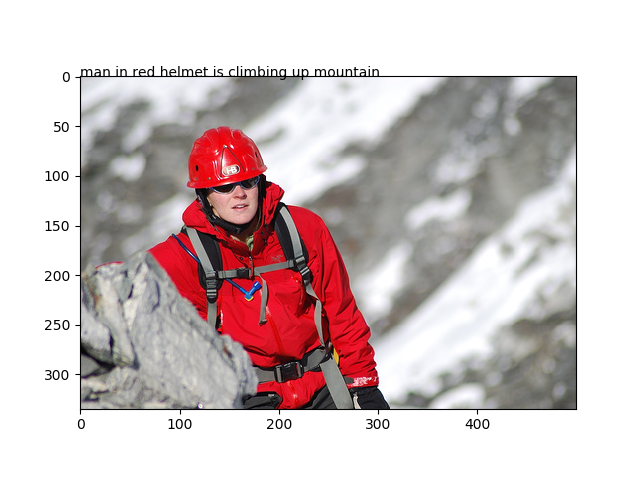

<H1>Dataset</H1>
AS the dataset file is large,please download it yourself.  
1.Flickr8k  
Directory example  
+-Flickr8k_Dataset  
----****.jpg  
+-Flickr8k_text  
----CrowdFlowerAnnotations.txt  
----ExpertAnnotations.txt  
----Flickr_8k.devImages.txt  
----Flickr_8k.testImages.txt  
----Flickr_8k.trainImages.txt  
----Flickr8k.lemma.token.txt  
----Flickr8k.token.txt  
+-Pickle  
----encoded_test_images.pkl  
----encoded_train_images.pkl  
--glove.6B.200d.txt  
###Processing flow


###Code
- root/utils/ImageCaptioning.py  
```
class Dataset:
    def __init__(self,token_path,
                 description_path,#to save the description result
                 train_dataset_path,
                 test_dataset_path,
                 images_directory,
                 image_suffix):
    ...
    def load_file(self,path):
    ...
    def load_descriptions(self,token_text):
    ...
    def clean_descriptions(self,description_mappinglist):
    ...
    #convert the loaded descriptions into a vocabulary of words
    def to_vocabulary(self,description_mappinglist):
    ...
    #save descriptions to file,one per line
    def save_descriptions(self,description_mappinglist,description_filepath):
    ...
    #load a pre-defined list of photo identifiers
    def load_set(self,filepath):
    ...
    #get the images
    def get_images(self,images_directory,images,image_names):
    ...
    #create a list of all the training captions
    def get_train_captions(self,train_descriptions):
    ...
    #consider only words which occur at least 10 times in the corpus
    def define_vocabulary_config(self,all_train_captions):
    ...
    #data generator,intended to be used in a call to model.fit_generator()
    def data_generator(self,descriptions,images,wordtoix,max_length,num_images_per_batch,vocab_size):
    ...
    
```
###Model
- root/tests/image_captioning/Image_Captioning_Model.py
```
inputs1 = Input(shape=(2048,))
fe1 = Dropout(0.5)(inputs1)
fe2 = Dense(256, activation='relu')(fe1)
inputs2 = Input(shape=(max_length,))
se1 = Embedding(vocab_size, embedding_dim, mask_zero=True)(inputs2)
se2 = Dropout(0.5)(se1)
se3 = LSTM(256)(se2)
decoder1 = add([fe2, se3])
decoder2 = Dense(256, activation='relu')(decoder1)
outputs = Dense(vocab_size, activation='softmax')(decoder2)
model = Model(inputs=[inputs1, inputs2], outputs=outputs)

model.layers[2].set_weights([embedding_matrix])
model.layers[2].trainable = False
```
###Train
- root/tests/image_captioning/Train.py
```
#define the directory of dataset
token_path = 'D:/dataset/image_caption/Flickr8k_text/Flickr8k.token.txt'
description_path = 'D:/dataset/image_caption/descriptions.txt'
train_dataset_path = 'D:/dataset/image_caption/Flickr8k_text/Flickr_8k.trainImages.txt'
test_dataset_path = 'D:/dataset/image_caption/Flickr8k_text/Flickr_8k.testImages.txt'
images_directory = 'D:/dataset/image_caption/Flickr8k_Dataset/'
image_suffix = 'jpg'

#init the dataset
dataset = Dataset(token_path,
                 description_path,
                 train_dataset_path,
                 test_dataset_path,
                 images_directory,
                 image_suffix)

glove_path = 'D:/dataset/image_caption/glove.6B.200d.txt'
#build the model
imageCaptioningModel = Image_Captioning_Model(glove_path,dataset.max_length,dataset.vocab_size,dataset.wordtoix)
model = imageCaptioningModel.model

train_features_path = 'D:/dataset/image_caption/Pickle/encoded_train_images.pkl'
test_features_path = 'D:/dataset/image_caption/Pickle/encoded_test_images.pkl'
#encode dataset
inceptionV3Encode = InceptionV3_Encode(images_directory,train_features_path,test_features_path,dataset.train_images,dataset.test_images)

#the model saved directory
model_path = 'D:/AI(CV)/sourcecode/0818/Image_caption/model_weights/'
#start training
epochs = 10
number_pics_per_bath = 3
steps = len(dataset.train_descriptions)//number_pics_per_bath
for i in range(epochs):
    generator = dataset.get_train_data_generator(number_pics_per_bath,inceptionV3Encode.train_features)
    model.fit_generator(generator, epochs=1, steps_per_epoch=steps, verbose=1)
    model.save(model_path+'model_' + str(i) + '.h5')

for i in range(epochs):
    generator = dataset.get_train_data_generator(number_pics_per_bath,inceptionV3Encode.train_features)
    model.fit_generator(generator, epochs=1, steps_per_epoch=steps, verbose=1)
    model.save(model_path+'model_' + str(i) + '.h5')

epochs = 10
number_pics_per_bath = 6
steps = len(dataset.train_descriptions)//number_pics_per_bath
for i in range(epochs):
    generator = dataset.get_train_data_generator(number_pics_per_bath,inceptionV3Encode.train_features)
    model.fit_generator(generator, epochs=1, steps_per_epoch=steps, verbose=1)
    #model.save('./model_weights/model_' + str(i) + '.h5')

model.save_weights(model_path+'model_30.h5')
```

###Test
- root/tests/image_captioning/Test.py
```
#init the model
glove_path = 'D:/dataset/image_caption/glove.6B.200d.txt'
imageCaptioningModel = Image_Captioning_Model(glove_path,dataset.max_length,dataset.vocab_size,dataset.wordtoix)
model = imageCaptioningModel.model

model_path = 'D:/AI(CV)/sourcecode/0818/Image_caption/model_weights/'
model.load_weights(model_path+'model_30.h5')

#load the test dataset
test_features_path = 'D:/dataset/image_caption/Pickle/encoded_test_images.pkl'
with open(test_features_path, "rb") as encoded_pickle:
    encoding_test = load(encoded_pickle)

#define the image description and predict the result
def greedySearch(photo):
    in_text = 'startseq'
    for i in range(dataset.max_length):
        sequence = [dataset.wordtoix[w] for w in in_text.split() if w in dataset.wordtoix]
        sequence = pad_sequences([sequence], maxlen=dataset.max_length)
        yhat = model.predict([photo,sequence], verbose=0)
        yhat = np.argmax(yhat)
        word = dataset.ixtoword[yhat]
        in_text += ' ' + word
        if word == 'endseq':
            break
    final = in_text.split()
    final = final[1:-1]
    final = ' '.join(final)
    return final

#show the predict result
z= random.randint(1,len(encoding_test.keys()))
pic = list(encoding_test.keys())[z]
image = encoding_test[pic].reshape((1,2048))
x=plt.imread(images_directory+pic)
plt.text(0,0,greedySearch(image))
plt.imshow(x)
plt.show()
```

